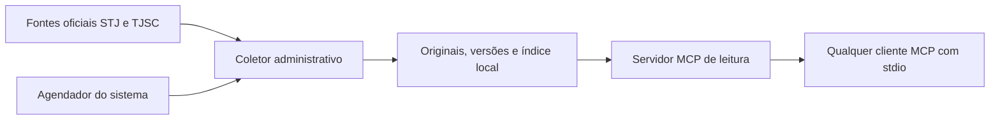

# Flora-MCP

MCP independente para pesquisar uma base local de jurisprudência pública, alimentada diretamente por fontes oficiais. Não depende do Flora, de um modelo de IA, do Copilot, do JusRatio ou de uma API jurídica paga.

**Estado: alpha local `0.2.0a1`.** Modelo de temas/súmulas, importação de pacotes oficiais conferidos, componentes separados, publicação de leitura, triagem e exportação documental implementados. Acórdãos STJ e coleta experimental TJSC preservados. O acervo é parcial; carga efetiva e recarga dos clientes exigem recibos próprios. Veja o [contrato da reforma](docs/precedentes-v2.md), [estado e próximos marcos](docs/estado.md) e [exemplo com ementas completas](docs/exemplo-real.md).

## Como funciona



O coletor incorpora novos documentos e alterações. O MCP consulta a base mesmo sem internet. A atualização é trabalho do sistema, sem LLM. Pesquisa lexical: palavras combinadas com AND ou frases entre aspas; sem interpretação semântica automática.

## Referências para conferência e uso em votos

Cada resultado de pesquisa inclui `relator`, `classe_descricao`, `referencia`,
`referencia_completa` e `referencia_pendencias`. A obtenção do documento entrega
esses mesmos campos em `metadados`, inclusive nos blocos de continuação.
Apresente a referência junto da ementa ou citação usada em voto e confira as
pendências. Julgamento e publicação são identificados separadamente; dados
ausentes não são inventados. A identificação vem da versão original preservada,
também para documentos já existentes, sem migração do banco.

Processos MCP já iniciados precisam ser reconectados para carregar esta mudança.
Veja [contrato, testes e estado de carregamento](docs/referencias-citacao.md).

## Instalar e usar

Requisitos: Python 3.12+ e `uv`. Nesta máquina foi verificado com Python 3.14, no Windows. Antes dos comandos, configure `data_dir` em `flora.local.toml` a partir do modelo. Em uma instalação nova, `init` cria o banco vazio; não é necessário executá-lo após uma migração:

```powershell
uv sync --frozen
uv run flora-mcp init
uv run flora-mcp sync-stj
uv run flora-mcp sync-tjsc --inicio 2026-09-18 --fim 2026-09-19
uv run flora-mcp search alimentos --tribunal STJ
uv run flora-mcp coverage
```

`sync-stj` consulta o catálogo e, por padrão, baixa até dois recursos pendentes por dataset em cada execução. Começa pelos mais recentes e avança no histórico nas execuções seguintes. Descobre arquivos novos, revê metadados alterados e reconfere bytes antigos após sete dias. Uma execução `partial` significa que ainda há recursos pendentes.

O recorte padrão seleciona arquivos de extração STJ com nomes a partir de `20250101`; **não promete todas as decisões publicadas desde essa data**. Datas de extração, julgamento e publicação são diferentes. Os ZIPs históricos ficam fora desta alpha.

`sync-tjsc` percorre todas as páginas de cada dia de publicação, nas duas câmaras, sem filtro temático. Valida órgão, data, quantidade e IDs, e confere novamente a primeira página. Uma falha impede a conclusão daquela janela. O portal pode mudar ou apresentar verificações de acesso; não há contorno de CAPTCHA ou autenticação.

Configure uma pasta absoluta em [flora.local.toml](flora.local.toml), na raiz desta instalação; o arquivo é carregado independentemente do diretório de execução. Há um [modelo TOML](flora.example.toml). Precedência: `--data-dir` **antes** do subcomando, `FLORA_MCP_DATA_DIR` e arquivo TOML. `--config` escolhe outro arquivo em lugar do local. Sem caminho configurado, o programa recusa iniciar; não há retorno automático ao AppData.

Nesta máquina, o acervo compartilhado fica em `C:\Users\Home\Documents\Flora\Dados\Flora-MCP`, fora do cofre Obsidian e dos pacotes MSIX. Coletas e backups exigem banco existente. Apenas `init` cria um banco novo, por comando explícito.

Para backup verificado de banco, originais e evidências: `.venv\Scripts\python.exe scripts/backup_acervo.py`. O destino padrão é a pasta irmã `Flora-MCP-backups`, com subpasta por data. Nenhuma atualização ou rotina de backup é agendada por esse comando.

## Conectar a um cliente MCP

O servidor usa `stdio`. O cliente inicia e encerra o processo. Neste computador, um exemplo de configuração é:

```json
{
  "mcpServers": {
    "flora-mcp": {
      "command": "C:/Users/Home/Documents/Flora-MCP/.venv/Scripts/python.exe",
      "args": ["-m", "flora_mcp.cli", "serve"],
      "env": {"PYTHONUTF8": "1"}
    }
  }
}
```

Adapte o contêiner de configuração ao cliente; alguns usam outro nome para `mcpServers`. Em outra máquina, substitua o caminho do executável. Este exemplo não instala conectores por si. Nesta máquina, o servidor foi registrado no Codex em 22/09/2026, e um processo separado do app-server reconheceu as três ferramentas. A recuperação foi exercitada por cliente SDK com os mesmos parâmetros. Isso não recarrega uma conversa já aberta nem comprova comportamento jurídico do agente. Recibos em `docs/instalacao-codex.json`, `docs/conexao-codex.json` e `docs/validacao-recuperacao.json`.

| Ferramenta | Uso |
|---|---|
| `pesquisar_jurisprudencia` | Termos/frases, processo, tribunal, órgão, classe e datas. Até cinco ementas completas por página. |
| `obter_documento` | Ementa ou espelho original, com fonte, hash e continuação explícita para textos longos. |
| `consultar_cobertura` | Órgãos carregados, lotes/janelas, pendências, falhas e últimas execuções. |

Não há ferramentas MCP de coleta, exclusão ou alteração de configuração. Banco aberto em modo de leitura nas consultas. As instruções eventualmente contidas em documentos recuperados devem ser tratadas como texto documental, não comandos.

## Atualização periódica

Uma rodada independente de atualização pode ser executada assim:

```powershell
uv run python scripts/update_once.py --tjsc-days 7
```

Ela processa os próximos lotes STJ e revisita uma janela móvel TJSC, incluindo o dia atual. O computador deve usar o fuso de Brasília. A janela curta inicial é configurável até 31 dias. Janelas anteriores continuam no banco; não são apagadas por saírem da janela móvel. Incorporações tardias anteriores à janela exigem reconciliação histórica, ainda pendente de automação.

O [registrador Windows](scripts/register-update-task.ps1) prepara uma execução diária às 07h15, sem elevação e com o usuário conectado. **O agendamento não foi ativado neste desenvolvimento.** Antes de ativar operação contínua, conferir estabilidade em dias diferentes e calibrar carga/horário. `-WhatIf` permite inspecionar o registro sem criá-lo. Logs ficam na pasta de dados, em `logs/`.

## Integridade e limites

- Arquivos originais por SHA-256, versões do conteúdo recebido e proveniência de ingestão. Para TJSC, os bytes HTML ficam preservados em base64 no envelope da coleta; a ementa de leitura é extraída do HTML.
- Identidade pelo documento de origem, nunca somente pelo processo. Alterações fora da ementa também geram versão.
- Banco e índice são atualizados na mesma transação. O recurso só é concluído após a gravação. Um bloqueio de escritor impede coletas concorrentes.
- Ementas não são encurtadas pelo programa. Documentos longos usam blocos numerados por posição; sua concatenação reproduz exatamente o texto armazenado. Isso não certifica a completude editorial do texto publicado pelo tribunal.
- No STJ, se recursos contêm versões divergentes, prevalece o arquivo de extração mais recente. A precedência é operacional e conservadora, não informação oficial de retificação. As observações antigas são preservadas.
- No TJSC, uma janela concluída significa todos os resultados que o portal informou no momento da coleta. O portal não oferece aqui um snapshot transacional; rechecagem de contagem e primeira página reduz, mas não elimina, corrida durante indexação.
- Uma consulta sem resultados não demonstra inexistência de jurisprudência. A cobertura parcial acompanha cada pesquisa.
- Inteiro teor não incorporado: `decisao` do espelho STJ não é tratado como voto integral; link TJSC não significa documento baixado ou disponível.
- Sem alegação de que um precedente permanece juridicamente vigente, análise de superação ou certificação de atualidade editorial.

## Backup e verificação

```powershell
uv run flora-mcp backup D:/Backups/flora-mcp-primeira-copia
uv run pytest -q
uv run ruff check src tests scripts
uv run python scripts/smoke_mcp.py
```

Backup copia banco por mecanismo consistente do SQLite e os originais, com checagem de integridade. Para restaurar, use uma **nova pasta** com `--data-dir`; preserve a pasta atual. O teste de restauração abre a cópia e confere busca, documento e original. `smoke_mcp.py` requer a amostra local com os três órgãos de demonstração e grava evidência de protocolo e ementas em `docs/`.

## Fontes e dependências

- [Catálogo oficial de dados abertos do STJ](https://dadosabertos.web.stj.jus.br/): conjuntos de espelhos da Terceira e Quarta Turmas e Segunda Seção. Atribuição ao STJ; o catálogo consultado informa `cc-by`.
- [Portal oficial de jurisprudência TJSC](https://www.tjsc.jus.br/web/jurisprudencia): consulta pública do eproc, 9ª e 10ª Câmaras de Direito Civil.
- [SDK oficial MCP para Python](https://github.com/modelcontextprotocol/python-sdk): versão 2.2.0 fixada. Dependências exatas em `uv.lock`.

O projeto não escolheu licença de distribuição do código próprio nem foi publicado remotamente. Disponibilidade pública da fonte não dispensa respeitar seus limites de acesso. A licença do código é distinta das condições dos dados.

## Extensão HTTP — 28/09/2026

Foi acrescentado o [adaptador HTTP autenticado](docs/http-studio.md) para Streamable HTTP, mantendo as três ferramentas de leitura. Testes locais de autenticação, Host/Origin e protocolo usam acervo sintético. Ainda não há hospedagem nem conexão com o Studio. As observações anteriores sobre ausência de transporte remoto referem-se ao estado anterior a esta extensão; inteiro teor continua pendente.

## Retomar histórico TJSC sem repetir janelas concluídas

`scripts/resume_tjsc.py` planeja as lacunas por câmara e dia de publicação.
Uma janela marcada `ok` só é dispensada após conferir seu original, hash,
câmara, data e quantidade de observações. Datas futuras são rejeitadas.

```powershell
uv run python scripts/resume_tjsc.py --data-dir <acervo> --inicio 2026-01-01 --fim 2026-09-29
```

Sem `--apply`, o comando apenas lê a base e mostra o plano. Para aplicar,
acrescente `--apply --report <novo-recibo.json> --backup <nova-pasta-de-backup>`.
O executor adquire o lock, refaz o plano, faz backup consistente e usa o mesmo
coletor e a mesma transação de ingestão do `sync-tjsc`. Conserva cada janela
concluída e para na primeira falha. Uma nova execução com recibo e backup novos
retoma as pendências a partir do banco, inclusive após interrupção.

Esse modo preenche lacunas; não reconcilia publicações tardias em dias já
concluídos. O dia corrente é provisório. Para reconsultar um intervalo concluído,
use o `sync-tjsc` normal, em recorte declarado de até 31 dias. Nenhum dos dois
comandos baixa o inteiro teor dos votos.
