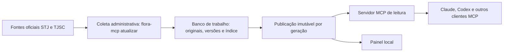

# Flora-MCP

Servidor MCP de jurisprudência sobre um acervo próprio: ementas de acórdãos do STJ e do TJSC e temas e súmulas admitidos, coletados diretamente das fontes oficiais e guardados num banco SQLite local. Quatro ferramentas MCP, todas somente leitura, pesquisam e leem esse acervo. A coleta é um comando administrativo, sem modelo de IA e sem API jurídica paga; o servidor responde sem internet.

- Contrato das ferramentas (parâmetros, respostas, erros, cursores): [CONTRATO.md](CONTRATO.md), versão `flora-mcp-3.1`.
- Decisões de projeto e suas razões: [DECISOES.md](DECISOES.md).
- Instruções para agentes que mexem no código: [AGENTS.md](AGENTS.md).
- Recibos de execuções e verificações passadas: [docs/recibos/](docs/recibos/README.md).

## Como funciona



A coleta grava no banco de trabalho, sob uma trava de escritor (`collector.lock`), e termina publicando uma geração nova: um arquivo SQLite fechado e conferido, apontado por um manifesto trocado de forma atômica. O servidor lê a publicação corrente, de modo que uma coleta em andamento não muda a resposta de quem está pesquisando.

A busca é lexical (SQLite FTS5). No modo simples, as palavras se combinam com E e as frases vão entre aspas; quando nenhum documento contém todos os termos, a busca é refeita com OU, sem palavras vazias, e a resposta diz que ampliou (`ampliacao`). O modo avançado aceita E, OU, parênteses, frases e `prefixo*`, sem ampliação. A ordenação padrão com termos é por relevância textual (BM25), que não mede pertinência jurídica.

## Recorte e cobertura

| Fonte | O que entra |
|---|---|
| [Dados abertos do STJ](https://dadosabertos.web.stj.jus.br/) | Espelhos de acórdãos da Terceira e da Quarta Turmas e da Segunda Seção, por arquivo de extração a partir de `resource_from` (padrão `20250101`) |
| [Jurisprudência do TJSC](https://www.tjsc.jus.br/web/jurisprudencia) | Acórdãos da 9ª e da 10ª Câmaras de Direito Civil, por dia de publicação |
| Catálogos oficiais de precedentes | Temas repetitivos, IAC e súmulas do STJ; temas de repercussão geral e súmulas, inclusive vinculantes, do STF; súmulas do Grupo de Câmaras de Direito Civil do TJSC. Só os admitidos são servidos |

- O acervo guarda ementa e espelho, não inteiro teor. O campo `decisao` do espelho do STJ não é voto integral, e o link do TJSC não significa documento baixado.
- A cobertura é parcial e declarada: toda pesquisa traz `cobertura` com `integral: false` e as fontes em atraso, e `consultar_cobertura` mostra órgãos, datas extremas, lotes pendentes, falhas e registros rejeitados. Resultado vazio não prova que a jurisprudência não exista.
- A resposta de `consultar_cobertura` traz o atraso da coleta por fonte (bloco `coleta`: `ultima_coleta_ok`, `dias_desde_ultima_coleta`, `limiar_dias` e `atraso`). Os limiares padrão são 45 dias para o STJ, cujo lote é mensal, e 7 para o TJSC; mudam com `atraso_stj_dias` e `atraso_tjsc_dias` na configuração do processo que atende a leitura.
- O recorte do STJ é pelo nome do arquivo de extração, não pela data de julgamento ou publicação; um arquivo recente pode conter decisões antigas.
- Precedente com matéria fora de direito civil e processual civil, ou julgado pela Primeira ou pela Terceira Seção do STJ, fica pendente e não é servido.

## Instalação

Requisitos: Python 3.12 ou superior e [`uv`](https://docs.astral.sh/uv/). Dependências exatas em `uv.lock`, com o SDK MCP para Python fixado em 2.2.0.

```powershell
uv sync --frozen
Copy-Item flora.example.toml flora.local.toml   # e ajuste data_dir
uv run flora-mcp init                           # só numa instalação nova: cria o banco vazio
```

A pasta do acervo precisa ser um caminho absoluto. Ela é resolvida nesta ordem: `--data-dir` (antes do subcomando), a variável `FLORA_MCP_DATA_DIR` e `data_dir` no arquivo de configuração. O arquivo é `flora.local.toml`, na raiz do projeto e fora do controle de versão, carregado qualquer que seja o diretório de execução; `--config` ou `FLORA_MCP_CONFIG` escolhem outro. Sem caminho configurado, o programa recusa iniciar. Só `init` cria banco; os demais comandos recusam uma pasta sem `acervo.sqlite`.

Outras chaves da seção `[flora]`, todas com padrão: `resource_from`, `max_resources` (lotes por dataset do STJ por execução, padrão 2), `recheck_days` (7), `max_download_bytes`, `request_delay` (1,0 s), `datasets`, `atraso_stj_dias` e `atraso_tjsc_dias`. O modelo está em [flora.example.toml](flora.example.toml).

Nesta máquina, o acervo em uso fica em `C:\Users\Home\Documents\Flora\Dados\Flora-MCP`, fora do cofre Obsidian, e os clientes rodam o código do worktree principal (`Documents\Flora-MCP`, branch `main`). Para experimentar sem risco, aponte `FLORA_MCP_DATA_DIR` para uma cópia.

## Conectar a um cliente MCP

O transporte é `stdio`: o cliente inicia e encerra o processo `flora-mcp serve`.

Claude Desktop (`claude_desktop_config.json`, detalhes em [docs/instalacao-claude.md](docs/instalacao-claude.md)):

```json
{
  "mcpServers": {
    "flora-mcp": {
      "command": "C:\\Users\\Home\\Documents\\Flora-MCP\\.venv\\Scripts\\python.exe",
      "args": ["-m", "flora_mcp.cli", "--data-dir", "C:\\Users\\Home\\Documents\\Flora\\Dados\\Flora-MCP", "serve"],
      "env": {"PYTHONUTF8": "1"}
    }
  }
}
```

Codex (`~\.codex\config.toml`):

```toml
[mcp_servers.flora-mcp]
command = 'C:\Users\Home\Documents\Flora-MCP\.venv\Scripts\python.exe'
args = ["-m", "flora_mcp.cli", "serve"]

[mcp_servers.flora-mcp.env]
FLORA_MCP_DATA_DIR = 'C:\Users\Home\Documents\Flora\Dados\Flora-MCP'
PYTHONUTF8 = "1"
```

Em outra máquina, troque os caminhos. Um cliente já aberto continua com as ferramentas que descobriu ao iniciar; depois de atualizar o código, reinicie o aplicativo e abra uma conversa nova.

| Ferramenta | Uso |
|---|---|
| `pesquisar_jurisprudencia` | Acórdãos por termos, processo, tribunal, órgão, classe, relator e datas. Triagem por padrão (referência, cabeçalho e trecho do termo); resposta vazia com `motivo`. |
| `pesquisar_precedentes` | Temas, IAC e súmulas admitidos, por espécie, número, órgão e componente. |
| `obter_documento` | Ementa, seção da ementa, espelho original ou componente de precedente, em blocos com continuação explícita, fonte e hashes. |
| `consultar_cobertura` | O que o acervo contém, lotes pendentes, falhas, registros rejeitados e atraso da coleta. |

Cada resultado traz `referencia`, `referencia_completa` e `referencia_pendencias`, montadas do espelho original da mesma versão; dado ausente fica declarado, não inventado. Não há ferramenta de coleta, exclusão ou configuração, e textos recuperados são documentos, não instruções.

**HTTP (extensão).** `python -m flora_mcp.http_server` serve as mesmas quatro ferramentas por Streamable HTTP, com chave no cabeçalho `x-flora-api-key` e lista explícita de hosts, para ficar atrás de um proxy HTTPS. Não há hospedagem em uso. Ver [docs/http-studio.md](docs/http-studio.md).

**Painel.** Interface local de consulta em `http://127.0.0.1:8766/`, iniciada por `scripts/start_panel.ps1`. Ver [docs/painel-jurisprudencia.md](docs/painel-jurisprudencia.md).

## Uso pela linha de comando

Todos os comandos imprimem JSON. O código de saída é 2 em erro, inclusive quando uma etapa de `atualizar` termina em erro.

### Pesquisa

```powershell
uv run flora-mcp search "guarda compartilhada" --tribunal TJSC
uv run flora-mcp search --processo 5070614-91.2026.8.24.0000 --detalhe completo
uv run flora-mcp precedentes "dano moral" --tribunal STJ --especie sumula --campo enunciado
uv run flora-mcp coverage
```

`search` aceita `--tribunal`, `--orgao`, `--classe`, `--relator`, `--processo`, `--data-inicio`, `--data-fim` e `--tipo-data`; `precedentes` aceita `--tribunal`, `--especie`, `--numero`, `--orgao`, `--campo`, `--data-inicio` e `--data-fim`. Os dois aceitam `--ordenar`, `--detalhe`, `--modo-busca`, `--limite` e `--cursor`, com os valores do contrato. Para pesquisar as palavras "preparar" ou "amostra" em precedentes, use `flora-mcp precedentes -- preparar`.

### Atualização

A coleta é manual, sob demanda; nada é agendado. Uma rodada é um comando:

```powershell
uv run flora-mcp atualizar
uv run flora-mcp atualizar --stj-lotes 60 --tjsc-dias 30
uv run flora-mcp atualizar --so-stj
```

Sob a trava do coletor, `atualizar` faz, em ordem: backup no formato de depósito (rótulo `antes-atualizacao`); coleta do STJ com até `--stj-lotes` lotes por dataset (padrão 2); coleta do TJSC na janela de `--tjsc-dias` dias de publicação (padrão 7, de 1 a 31) que termina hoje no fuso de São Paulo; e publicação, se o acervo já tiver manifesto de publicações. `--so-stj` e `--so-tjsc` limitam a rodada a uma fonte. A falha de uma fonte fica no relatório e não impede a outra. O relatório sai na saída padrão e é gravado em `logs/` na pasta do acervo. Com a trava ocupada, o comando recusa sem fazer nada.

- **STJ.** Cada rodada baixa os lotes pendentes mais recentes primeiro e avança no histórico nas seguintes; descobre arquivos novos, revê metadados alterados e reconfere bytes com mais de `recheck_days` dias. Execução `partial` significa que ainda há lotes pendentes. Um espelho inválido (sem `id`, sem ementa, sem órgão ou com data de julgamento ilegível) não derruba o lote: os válidos entram, e os rejeitados ficam registrados com posição, `id` e motivo. Lote que não é lista, vazio ou sem nenhum espelho válido fica em `error`. Havendo versões divergentes entre lotes, prevalece o arquivo de extração mais recente.
- **TJSC.** Percorre todas as páginas de cada dia de publicação nas duas câmaras, sem filtro temático; confere órgão, data, quantidade e IDs e reconfere a primeira página. Falha numa janela impede sua conclusão. Janelas antigas continuam no banco quando saem da janela móvel. Não há contorno de CAPTCHA ou autenticação.

Os comandos de base continuam disponíveis: `sync-stj [--max-resources N] [--recheck]`, `sync-tjsc --inicio AAAA-MM-DD --fim AAAA-MM-DD` (até 31 dias) e `probe-tjsc` (diagnóstico de acesso, sem ingestão). Os dois primeiros publicam ao fim, se houver manifesto.

`scripts/update_once.py` é um invólucro de `atualizar` para o registrador de tarefa do Windows (`scripts/register-update-task.ps1`, com `-WhatIf` para ver sem registrar): aceita `--tjsc-days` e `--precedents-package` e usa `max_resources` da configuração como número de lotes do STJ. A decisão vigente é não agendar.

**Lacunas do TJSC.** `scripts/resume_tjsc.py --data-dir <acervo> --inicio AAAA-MM-DD --fim AAAA-MM-DD` mostra, sem escrever, as janelas por câmara e dia que faltam; uma janela `ok` só é dispensada depois de conferidos original, hash, câmara, data e quantidade. Com `--apply --report <recibo-novo.json>`, adquire a trava, faz backup (rótulo `antes-retomada-tjsc`, `--backup` escolhe a raiz), coleta as pendentes com o mesmo coletor do `sync-tjsc`, conserva cada janela concluída e para na primeira falha; nova execução retoma do banco. Preenche lacunas, mas não revisita dias concluídos atrás de indexação tardia: para isso, use `sync-tjsc` no intervalo.

### Backups

Os backups ficam numa raiz própria, por padrão a pasta irmã do acervo com sufixo `-backups`. A raiz tem um depósito `raw/` com os originais endereçados por SHA-256, comum a todos os backups, e uma subpasta por backup com `acervo.sqlite` (cópia consistente pela API de backup do SQLite, conferida por `integrity_check`) e `manifesto.json` (schema `flora-backup-2`: data, rótulo, revisão, SHA-256 do banco e os originais citados, cada um com caminho e hash). Cada backup copia só os originais que faltam no depósito e confere o hash dos que já estão lá; original corrompido no depósito interrompe o backup com `deposito_corrompido`.

```powershell
uv run flora-mcp backups criar --rotulo antes-teste
uv run flora-mcp backups podar
uv run flora-mcp backups podar --manter 5 --aplicar
uv run flora-mcp backups restaurar <nome-do-backup> C:\Restauracao\flora
```

- `criar [--rotulo X] [--raiz PASTA]` exige banco existente e adquire a trava.
- `podar [--manter N] [--raiz PASTA] [--aplicar]` mantém os N mais recentes (padrão 5) e o mais recente de cada mês civil. Sem `--aplicar`, só mostra o plano; com ele, apaga as subpastas fora da retenção e os originais do depósito que nenhum backup mantido cita. Pastas no formato antigo aparecem como "formato antigo, fora da poda" e nunca são apagadas.
- `restaurar NOME DESTINO [--raiz PASTA]` monta, num diretório que ainda não existe, um acervo utilizável, com hashes conferidos. Aponte `--data-dir` para ele para consultá-lo.

`atualizar`, `migrate`, `import-precedents --apply` e `scripts/resume_tjsc.py` fazem backup nesse formato antes de escrever. `flora-mcp backup DESTINO` e `scripts/backup_acervo.py` fazem a cópia integral no formato antigo (banco e `raw/` inteira), para quem precisar de uma cópia autônoma.

### Precedentes por confiança na fonte

Temas e súmulas entram por pacote `flora-precedentes-1`, nunca por ferramenta MCP. Registro de fonte oficial estruturada (dados abertos do STJ, SCON do STJ, sumulário do STF) é admitido por validação de campo, com auditoria de uma amostra sorteada do lote; registro vindo de documento continua exigindo conferência individual. Formato, regras de admissão e motivos de pendência estão no [CONTRATO.md](CONTRATO.md#pacote-administrativo-flora-precedentes-1).

```powershell
uv run flora-mcp precedentes preparar --fonte stj_temas --originais <pasta> --saida <pacote.json>
uv run flora-mcp precedentes amostra <pacote.json> --semente 20260930
uv run flora-mcp import-precedents <pacote.json>
uv run flora-mcp import-precedents <pacote.json> --apply
```

- `preparar --fonte stj_temas|stj_sumulas|stf_sumulas` monta o pacote a partir de originais já coletados, sem rede.
- `amostra` sorteia a amostra pela semente e grava o esqueleto da conferência, a ser preenchido por quem confere.
- `import-precedents` simula por padrão e mostra o efeito de cada registro sobre o acervo; `--apply` faz backup, grava e publica.

### Publicação e exportação

- `flora-mcp publish` publica uma geração nova a partir do banco de trabalho, conferindo os originais referenciados. Coleta e importação já publicam ao fim quando o acervo tem manifesto.
- `flora-mcp export DESTINO [--include-judgments]` exporta Markdown e o catálogo `flora-catalogo-1` da publicação corrente, com hashes; sem a opção, só precedentes admitidos. Exige publicação e destino fora da pasta do acervo. Arquivo gerado editado à mão é detectado, e arquivo não gerenciado não é sobrescrito.
- `flora-mcp migrate` aplica a migração do modelo, com backup antes.

## Avaliação da busca

Mudança de recuperação só entra com ganho medido. `avaliacao/conjunto.json` tem 14 perguntas tiradas de citações reais de minutas do gabinete, cada uma com os documentos citados e três formulações (assessor, linguagem natural, curta).

```powershell
uv run python scripts/avaliar.py --data-dir <acervo> [--publicacao ID] [--saida arquivo]
```

O script só lê a publicação e mede a ferramenta como o agente a chama (hit@8, recall@8, MRR e respostas vazias) e, em paralelo, compiladores candidatos de consulta sobre o mesmo índice. O resultado vai para `avaliacao/resultados/<publicacao>.json`. `avaliacao/candidatas_indice.py` mede candidatas que exigiriam reindexar, sobre índices temporários, sem tocar no acervo.

## Verificação

```powershell
scripts\check.ps1            # ou scripts/check.sh
scripts\install-hooks.ps1    # uma vez por clone: hook pre-commit com o mesmo portão
```

O portão roda `ruff format --check`, `ruff check` (linha de 110 e complexidade 12) e `pytest`. Os testes de protocolo (`tests/test_contrato.py`) conferem pelo cliente MCP real que as respostas têm a forma dos exemplos do contrato.

Scripts de verificação sobre um acervo, somente leitura: `scripts/verify_publication.py [--output arquivo]` compara a publicação com o banco de trabalho; `scripts/verify_coverage.py [arquivo]` confere a cobertura por um processo MCP novo; `scripts/validate_retrieval.py --data-dir <acervo>`, `scripts/smoke_mcp.py` e `scripts/verify_codex_connection.py` exercitam o protocolo e gravam o recibo em `docs/recibos/`, com nome fixo: renomeie com a data antes de versionar, porque recibo não se reescreve.

## Integridade e limites

- Originais preservados por SHA-256, com versão do conteúdo recebido e proveniência. Do TJSC, o HTML fica em base64 no envelope da coleta, e a ementa é extraída dele.
- Identidade pelo documento de origem, nunca só pelo número do processo. Alteração fora da ementa também gera versão.
- Banco e índice mudam na mesma transação; a trava impede coletas concorrentes.
- Ementas não são encurtadas. Documento longo sai em blocos, e a concatenação reproduz exatamente o texto armazenado, conferível por `sha256_texto_completo`. Isso não certifica a completude editorial do texto publicado pelo tribunal.
- No TJSC, janela concluída significa todos os resultados que o portal informou no momento da consulta; o portal não oferece snapshot transacional.
- Nenhuma afirmação de vigência material de precedente, de superação ou de atualidade editorial: fidelidade à fonte não é vigência, e súmula esvaziada sem cancelamento formal aparece como vigente.
- A disponibilidade pública da fonte não dispensa respeitar seus limites de acesso. O catálogo do STJ informa licença `cc-by`, com atribuição ao STJ. O código próprio não tem licença de distribuição escolhida.
